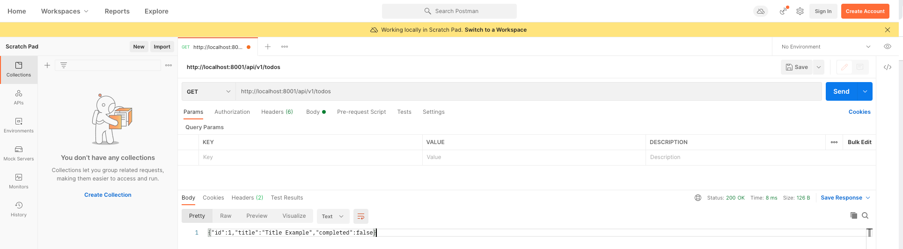

# ToDo - Rest Server

Esto es api rest para el manejo de tareas, permitiendo crear muchas tareas, actualizarlas
eliminarlas y obtenerlas para poder verlas en cualquier cliente o cualquier web app

Alumno: Jesus Emmanuel Gonzalez Vega

## Installation
Lo primero es tener instalado el CLI de maeven para poder instalar y correr nuestra api

Primero para instalar maven cli en mac, deberemos tener instalado brew, antes, ahora si para instalar maven utilizamos el siguiente comando:

```brew install maven```

Despues deberemos empaquetar nuestro proyecto con el sig comando:

```mvn assembly:assembly package```

Una vez compilado nuestro proyecto para correr nuestra api deberemos correr el siguiente comando

```java -jar target/rest-server-1.0-SNAPSHOT-jar-with-dependencies.jar```

## Usage

Para usar nuestra api se puede usar desde cualquier cliente consumiendo la siguiente URL

```localhost:8001/api/v1/todos```

Nos respondera con un JSON como se muestra acontinuacion:

```
{
   id: 1,
   title: "First ToDo",
   completed: false,
}
```

Yo recomiendo usar Postman como cliente para consumir y hacer pruebas con nuestra api


